##About the project

This website is a platform for World of Warcraft boosting services, developed primarily for learning purposes. The front end uses React with Tailwind CSS. Data is loaded dynamically from Firebase's database, and the back-end logic is implemented using Firebase Functions. The logo and color scheme were sourced from a designer on Fiverr, and all images come from Midjourney. The design and structure of this site were inspired by the Overgear website.

Disclaimer: The website is still in development. Several features have not been implemented yet, and the content, including service information and prices, is currently incomplete as you can see in the images below. Please note that some of the API keys are currently visible and not placed in a proper .env file due to the project's ongoing development stage.

##Home Page
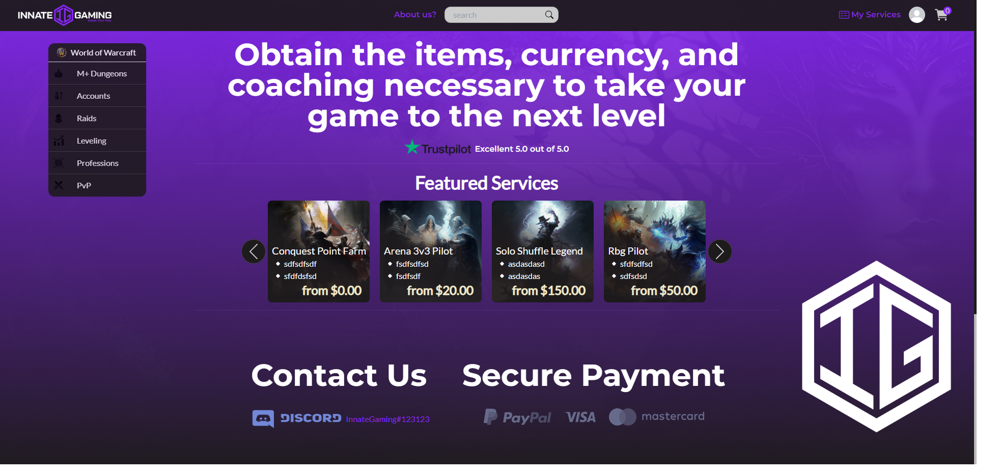

##Sign In page
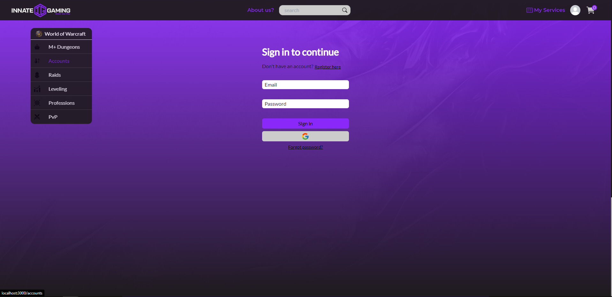

##Sign Up page
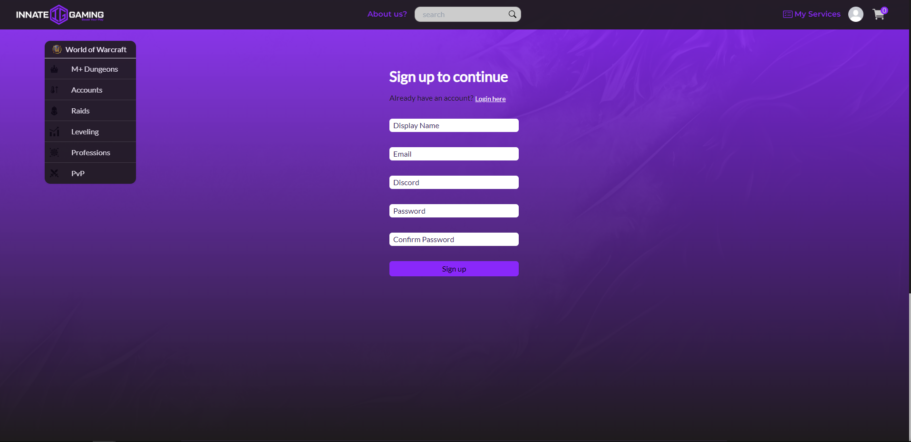

##Footer 
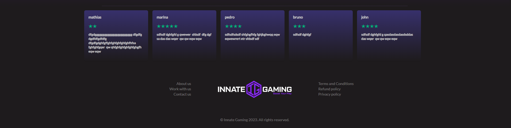

##Footer links page
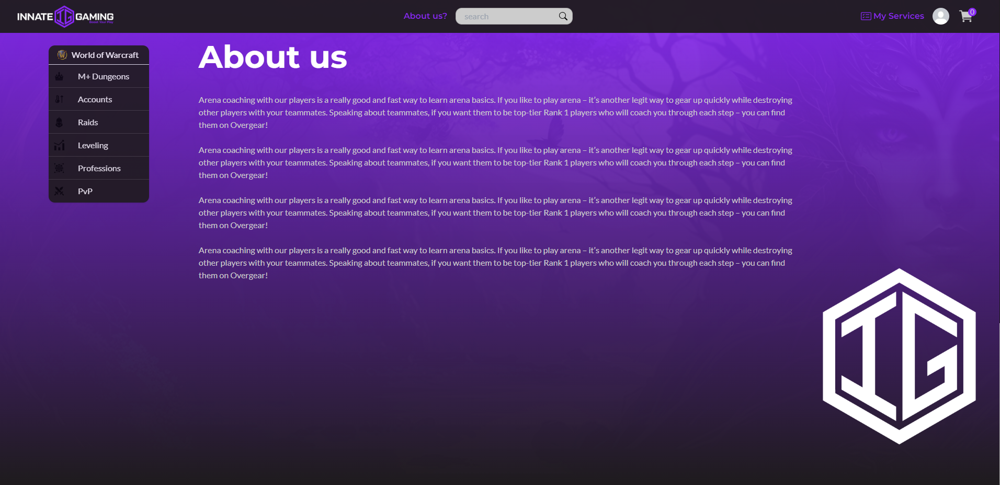

##Category page
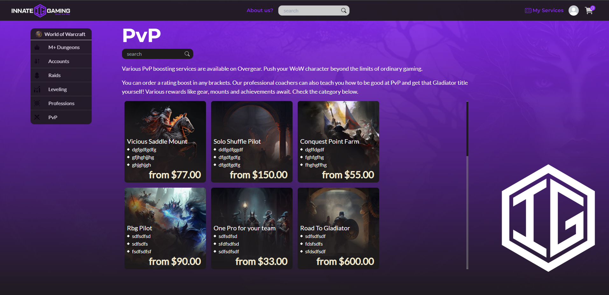

##Service page
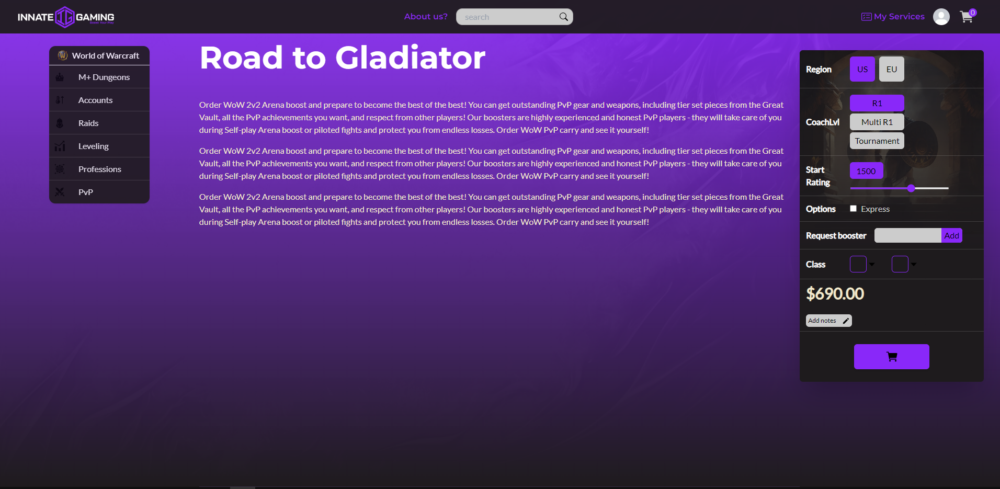

##Cart dropdown

##About us dropdown
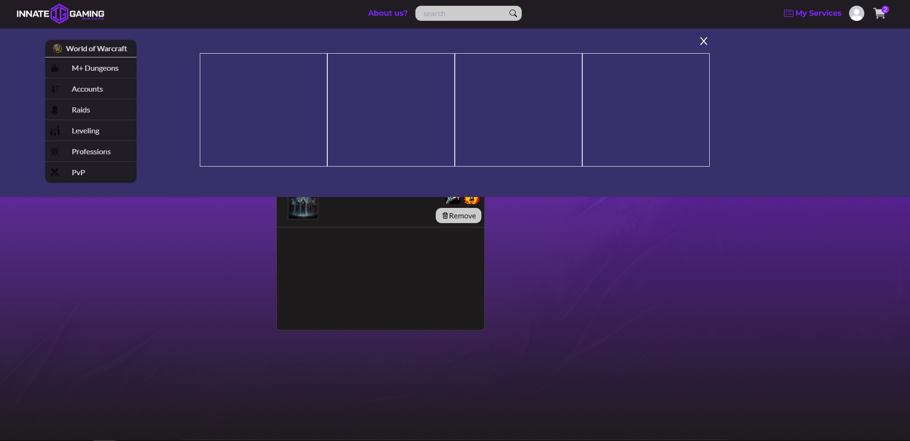

##Service search
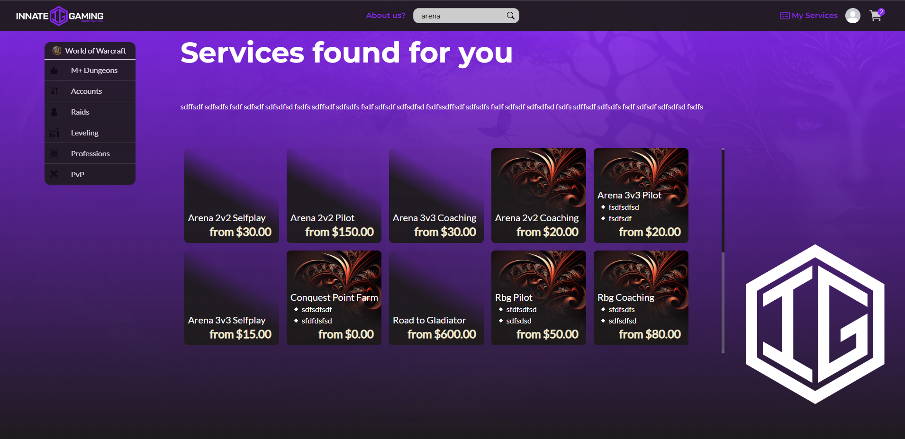

##User services page
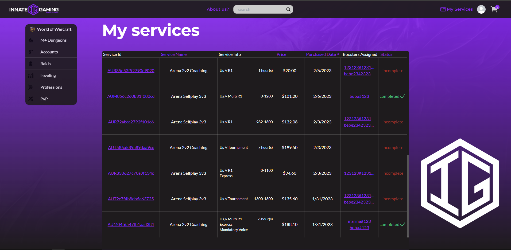

##User profile page
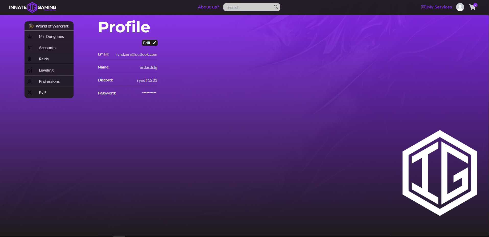

##Checkout page
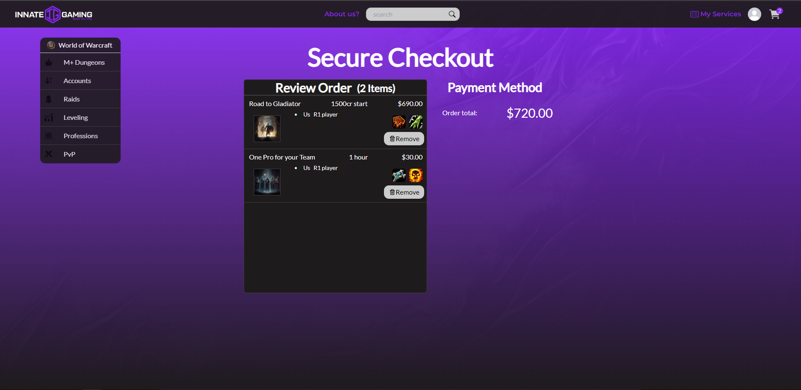

##Admin dashboard
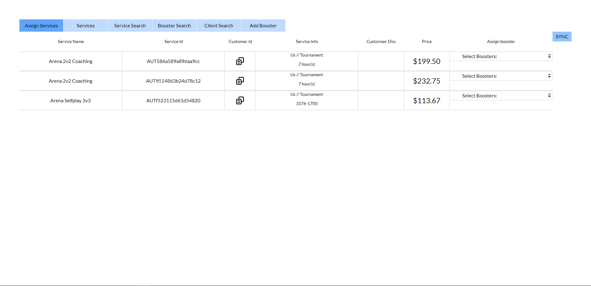

